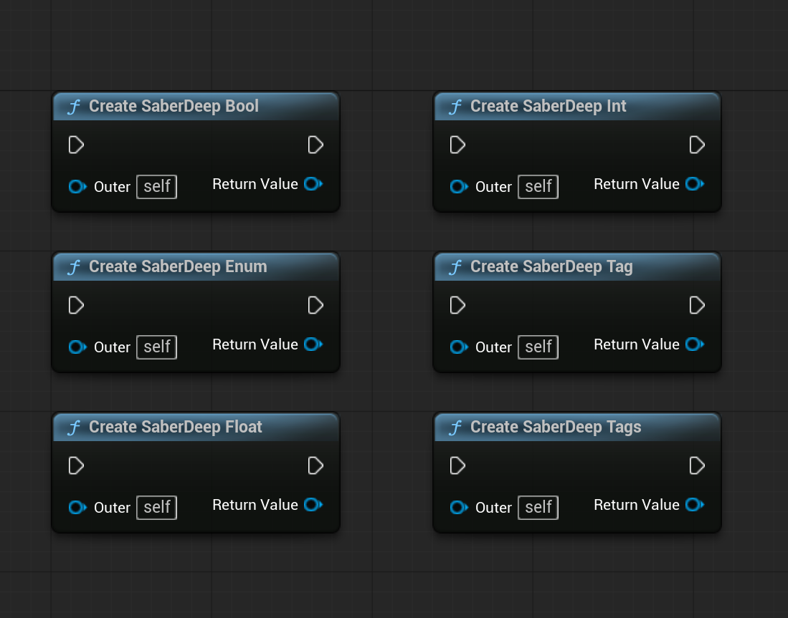
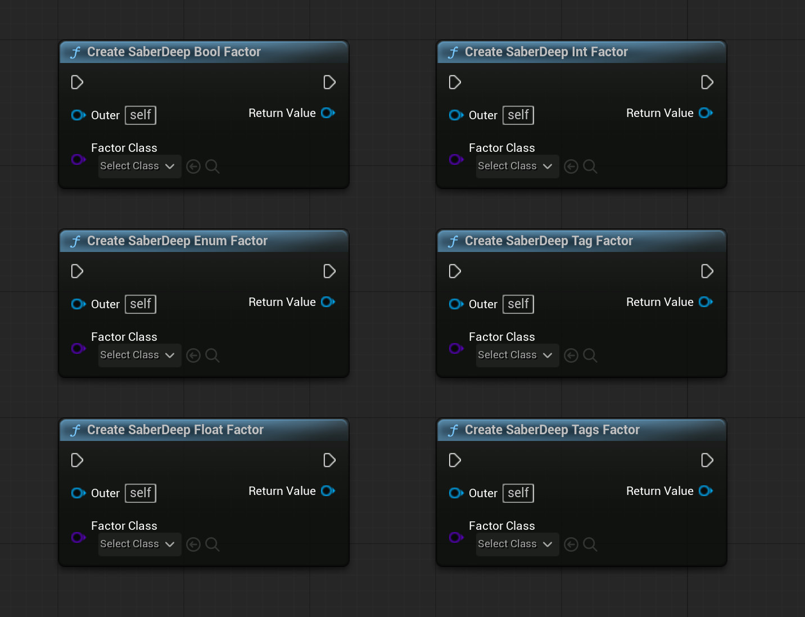
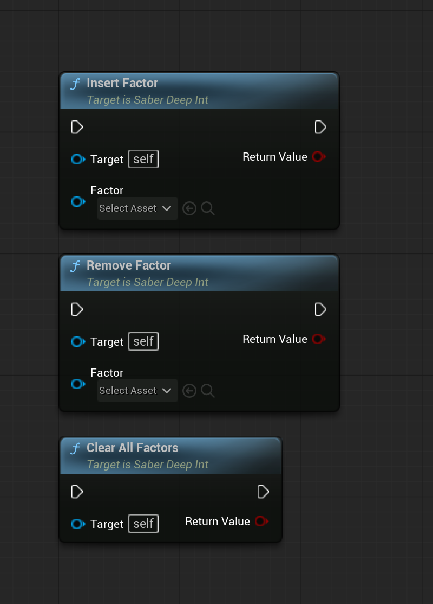
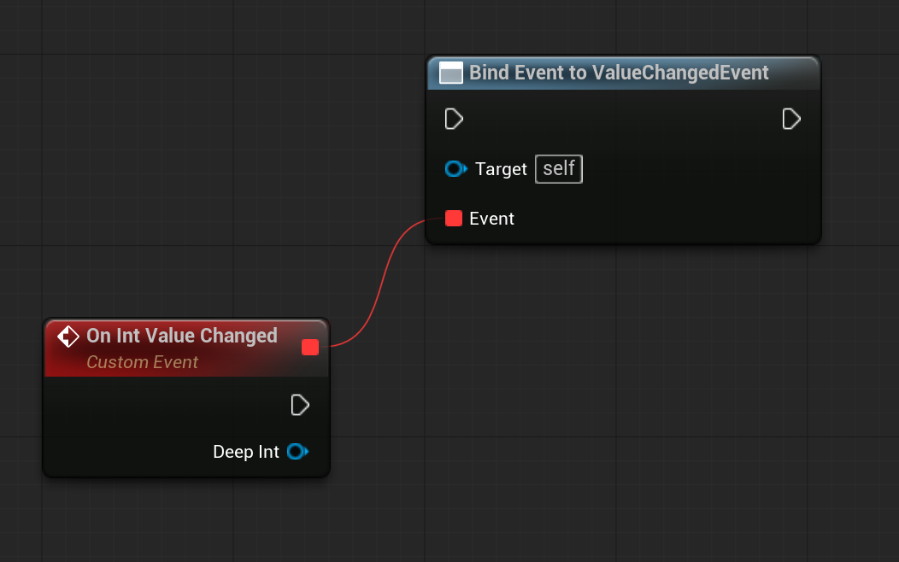
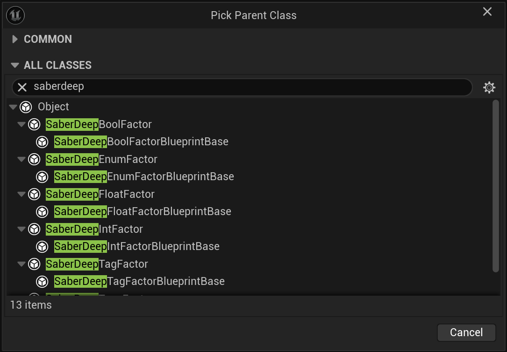
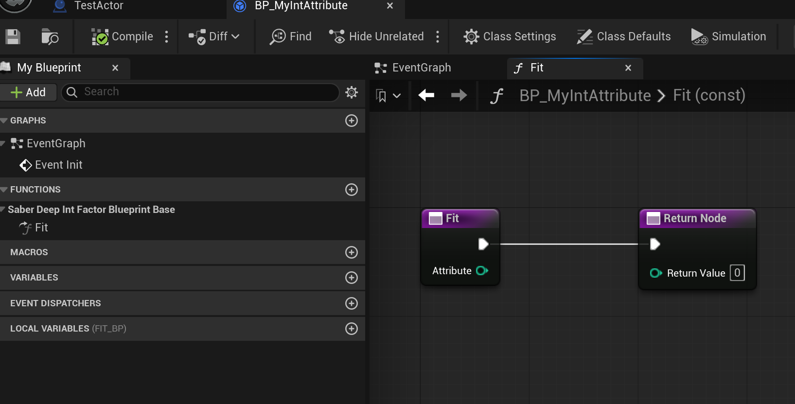

# Blueprint

SaberDeep is Blueprint-compatible.

Attributes and factors are UObjects. In Blueprint, create them through SaberDeep factory nodes and keep the returned references in variables.

## Create Attributes

Factory nodes are available under the `SaberDeep` category:

| Node | Returns |
| --- | --- |
| `Create SaberDeep Int` | `USaberDeepInt` |
| `Create SaberDeep Float` | `USaberDeepFloat` |
| `Create SaberDeep Bool` | `USaberDeepBool` |
| `Create SaberDeep Enum` | `USaberDeepEnum` |
| `Create SaberDeep Tag` | `USaberDeepTag` |
| `Create SaberDeep Tags` | `USaberDeepTags` |

{ .saber-screenshot }

The `Outer` input defaults to `self`. Use an owner that will live at least as long as the attribute.

## Enum Attributes in Blueprint

`USaberDeepEnum` is exposed as byte-based state in Blueprint.

Use it when a compact single-state value is enough. Convert between your Blueprint enum and byte where needed.

If designers need readable named states in the graph or Details panel, prefer `USaberDeepTag` or `USaberDeepTags`.

## Create Factors

Factory nodes are available under the `SaberDeep|Factor` category:

| Node | Factor class input |
| --- | --- |
| `Create SaberDeep Int Factor` | subclass of `USaberDeepIntFactor` |
| `Create SaberDeep Float Factor` | subclass of `USaberDeepFloatFactor` |
| `Create SaberDeep Bool Factor` | subclass of `USaberDeepBoolFactor` |
| `Create SaberDeep Enum Factor` | subclass of `USaberDeepEnumFactor` |
| `Create SaberDeep Tag Factor` | subclass of `USaberDeepTagFactor` |
| `Create SaberDeep Tags Factor` | subclass of `USaberDeepTagsFactor` |

{ .saber-screenshot }

The factory returns an empty object reference when the class input is empty or abstract.

## Attribute Nodes

Each attribute exposes these Blueprint operations:

| Node | Purpose |
| --- | --- |
| `Get Origin` | Reads the base value. |
| `Get Final` | Reads the computed value. |
| `Set Origin` | Updates the base value. |
| `Reset` | Clears all factors, sets origin, then refreshes when `Auto Refresh` is enabled. |
| `Insert Factor` | Adds one factor if it is not already inserted. |
| `Remove Factor` | Removes one factor. |
| `Clear All Factors` | Removes all factors. |
| `Refresh` | Recomputes `Final`. |
| `Is Auto Refresh` | Reads the auto refresh flag. |
| `Set Auto Refresh` | Changes the auto refresh flag. |
| `Is Auto Broadcast` | Reads the event broadcast flag. |
| `Set Auto Broadcast` | Changes the event broadcast flag. |

{ .saber-screenshot }

The same factor lifecycle is available on each attribute family, with the target type matching the attribute.

## Value Changed Event

Each attribute exposes `ValueChangedEvent`.

{ .saber-screenshot }

## Custom Blueprint Factors

Create a Blueprint class based on one of these classes:

- `USaberDeepIntFactorBlueprintBase`
- `USaberDeepFloatFactorBlueprintBase`
- `USaberDeepBoolFactorBlueprintBase`
- `USaberDeepEnumFactorBlueprintBase`
- `USaberDeepTagFactorBlueprintBase`
- `USaberDeepTagsFactorBlueprintBase`

{ .saber-screenshot }

Implement:

| Event | Purpose |
| --- | --- |
| `Init` | Initializes factor values after the SaberDeep factory creates the factor. |
| `Fit` | Receives the current attribute value and returns the transformed value. |

{ .saber-screenshot }

`Init` is called by the SaberDeep factory. It is not called from Class Default Object initialization.

Use Blueprint factor classes when designers need custom gameplay calculations without writing C++.

For example, a custom int factor can:

1. Derive from `USaberDeepIntFactorBlueprintBase`.
2. Set default factor data in `Init`.
3. Implement `Fit` to receive the current value and return the modified value.
4. Be created with `Create SaberDeep Int Factor`.
5. Be inserted into a `USaberDeepInt` attribute.

Blueprint can customize factor behavior for the built-in SaberDeep attribute families. Creating a completely new value type is a C++ extension task.

## Lifetime Rule

Attributes keep weak references to inserted factors.

The Blueprint that creates or inserts a factor must keep a strong reference to that factor, usually in a variable. If no strong reference is kept, Unreal garbage collection can invalidate the factor and SaberDeep will remove it on refresh.
